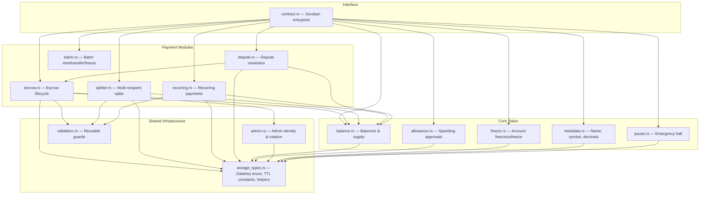

# Architecture — Veritix Pay

## Overview

Veritix Pay is an on-chain payment infrastructure smart contract for the
Veritix ticketing platform, deployed on Stellar via **Soroban**. It is written
in Rust and compiled to WebAssembly (WASM).

The contract is organised into focused modules that share a common storage
layer, authorisation model, and event emission pattern.

---

## Module Dependency Diagram



**Key insight:** Every payment module depends on `balance.rs` for token
movement and `storage_types.rs` for key definitions and TTL bump helpers.
`escrow.rs` is a dependency of `dispute.rs` since disputes operate on escrow
records.

---

## Data Flow

### Escrow → Dispute → Release

The canonical data flow for a contested ticket purchase:

```
  Buyer (Depositor)
       │
       │  1. create_escrow(amount, expiry)
       │     └─ tokens move from buyer → contract address
       ▼
  EscrowRecord (stored at DataKey::Escrow(id))
       │
       ├── Normal path ──────────────────────────────────┐
       │  2a. release_escrow()                            │
       │      └─ tokens move from contract → organizer    │
       │                                                  │
       └── Dispute path ─────────────────────────────────┤
           2b. open_dispute(escrow_id, resolver)           │
               └─ DisputeRecord created                    │
               └─ EscrowDispute(escrow_id) pointer set     │
           3b. resolve_dispute(dispute_id, outcome)        │
               └─ if resolved for beneficiary → release    │
               └─ if resolved for depositor   → refund     │
                                                           │
       Split path ────────────────────────────────────────┘
           2c. create_split(recipients, total)
               └─ tokens move from sender → contract
           3c. distribute(split_id)
               └─ tokens distributed proportionally via BPS
```

### Recurring Payment Flow

```
  Payer                           Payee
    │                               │
    │  1. setup_recurring(amount,   │
    │     interval)                 │
    │     └─ requires both auths    │
    ▼                               │
  RecurringRecord                   │
    │                               │
    │  2. execute_recurring(id)     │
    │     └─ anyone can "crank"     │
    │     └─ tokens: payer → payee  │
    ▼                               ▼
  Funds transferred after interval elapses
```

### Escrow-Release Lifecycle (State Machine)

```
                    ┌─────────────┐
                    │   CREATED   │
                    └──────┬──────┘
                           │
              ┌────────────┼────────────┐
              │            │            │
              ▼            ▼            ▼
        ┌──────────┐ ┌──────────┐ ┌──────────┐
        │ RELEASED │ │ REFUNDED │ │ DISPUTED │
        └──────────┘ └──────────┘ └─────┬────┘
                                        │
                                 ┌──────┴──────┐
                                 │             │
                                 ▼             ▼
                           ┌──────────┐ ┌──────────┐
                           │ RESOLVED │ │ RESOLVED │
                           │   FOR    │ │   FOR    │
                           │ BENEF.   │ │ DEPOS.   │
                           └──────────┘ └──────────┘
                                      (both terminal)
```

---

## Storage Architecture

Soroban uses a key-value store with two storage tiers:

| Tier | Access Pattern | Use Case | TTL Policy |
|------|---------------|----------|------------|
| **Instance** | `env.storage().instance()` | Global config, counters, admin, metadata, total supply | Bumped via `bump_instance()` on every access; also bumped centrally in `increment_counter()` |
| **Persistent** | `env.storage().persistent()` | Per-user records (balances, allowances, escrows, splits, recurring, disputes, freezes) | Bumped on read/write with module-specific constants (e.g., `BALANCE_*`, `ESCROW_*`, `SPLIT_*`) |

### Key Prefixes

All storage keys are defined as variants of the `DataKey` enum in
`storage_types.rs`:

```
Instance keys:
  Admin                  → Address
  Metadata               → TokenMetadata
  TotalSupply            → i128
  EscrowCount            → u32
  SplitCount             → u32
  RecurringCount         → u32
  DisputeCount           → u32
  Paused                 → bool

Persistent keys:
  Balance(Address)       → i128
  Allowance(DataKey)     → AllowanceValue { amount, expiration_ledger }
  SpenderAllowances      → Vec<Address>
  Freeze(Address)        → bool
  Escrow(u32)            → EscrowRecord
  Split(u32)             → SplitRecord
  Recurring(u32)         → RecurringRecord
  Dispute(u32)           → DisputeRecord
  EscrowDispute(u32)     → u32
  EscrowDisputeHistory   → Vec<u32>
  ResolverDisputes       → Vec<u32>
  OpenDisputes           → Vec<u32>
  PayerRecurrings        → Vec<u32>
  DepositorEscrows       → Vec<u32>
  BeneficiaryEscrows     → Vec<u32>
```

### TTL Constants

All TTL constants are defined in `storage_types.rs` and follow a naming
convention of `{MODULE}_LIFETIME_THRESHOLD` (min remaining before bump) and
`{MODULE}_BUMP_AMOUNT` (extension duration):

| Constant Set | Value (ledgers) | Rationale |
|-------------|-----------------|-----------|
| `INSTANCE_*` | ~535k (≈30 days @ 5s) | Contract lives for admin cycles |
| `BALANCE_*` | ~535k | Active addresses are re-bumped on every tx |
| `ALLOWANCE_*` | ~535k | Allowances are refreshed on each use |
| `PERSISTENT_*` | ~535k | Default for index lists |
| `ESCROW_*` | ~7.9M (≈1 year) | Escrows can live until event date |
| `SPLIT_*` | ~535k | Splits are short-lived |
| `RECURRING_*` | ~535k | Recurrings live for scheduled durations |
| `DISPUTE_*` | ~535k | Disputes have bounded windows |

---

## Authorisation Model

The contract uses two authorisation patterns:

### 1. User Auth (`require_auth`)

Every state-mutating function that acts on behalf of a specific user calls
`<address>.require_auth()` before touching storage. This enforces that the
caller has signed the transaction.

**Examples:**
- `transfer`: `from.require_auth()`
- `create_escrow`: `depositor.require_auth()`
- `setup_recurring`: both `payer.require_auth()` and `payee.require_auth()`
- `open_dispute`: `claimant.require_auth()`

### 2. Admin Auth (`check_admin`)

Admin-gated functions use `check_admin` which first calls
`admin.require_auth()` and then verifies the caller matches the stored admin
address.

**Examples:**
- `mint`, `freeze`, `unfreeze`, `clawback`
- `set_admin`, `update_metadata`
- `pause`, `unpause`
- `admin_settle_escrow`

### Auth by Module

| Module | Auth Pattern |
|--------|-------------|
| `admin` | Current admin must sign for rotation |
| `balance` | Caller's `require_auth` at the contract level |
| `allowance` | Owner must sign `approve` |
| `escrow` | Depositor signs create; beneficiary signs release; depositor or anyone (if expired) signs refund |
| `dispute` | Claimant signs open; resolver signs resolve |
| `splitter` | Sender signs create; sender signs distribute/cancel |
| `recurring` | Both payer and payee sign setup; payer signs cancel/amend |
| `freeze` | Admin only |
| `batch` | Admin for mint/freeze/clawback; sender auth for transfer |
| `pause` | Admin only |

---

## Event Flow

All state-changing operations emit events in a consistent format:

### Event Topics

Events use `symbol_short!` keys (7-character max symbol) as the first topic,
followed by domain-specific addresses or IDs:

```
(symbol_short!("event_name"), arg1, arg2, ...) → payload
```

### Events by Module

| Module | Event | Topics | Payload |
|--------|-------|--------|---------|
| Token | `mint` | (mint, admin, to) | amount |
| Token | `burn` | (burn, from) | amount |
| Token | `transfer` | (transfer, from, to) | amount |
| Token | `approve` | (approve, from, spender) | amount |
| Token | `clawback` | (clawback, admin, from) | amount |
| Admin | `admin_set` | (admin_set, old_admin) | new_admin |
| Freeze | `frozen` | (frozen, target) | admin |
| Freeze | `unfrozen` | (unfrozen, target) | admin |
| Pause | `paused` | (paused, admin) | () |
| Pause | `unpaused` | (unpaused, admin) | () |
| Batch | `batch_mint` | (batch_mint, admin) | total |
| Batch | `batch_xfer` | (batch_xfer, from) | total |
| Batch | `batch_frz` | (batch_frz, admin) | count |
| Batch | `batch_unf` | (batch_unf, admin) | count |
| Transfer | `tr_memo` | (tr_memo, from, to) | (amount, memo) |
| Metadata | `meta_upd` | (meta_upd, admin) | () |
| Escrow | `escrow_created` | (escrow_created, depositor, beneficiary) | amount |
| Escrow | `escrow_released` | (escrow_released, escrow_id, beneficiary) | amount |
| Escrow | `escrow_refunded` | (escrow_refunded, escrow_id, depositor) | amount |
| Escrow | `adm_settle` | (adm_settle, escrow_id, admin) | (recipient, amount) |
| Dispute | `dispute_opened` | (dispute_opened, escrow_id, claimant) | () |
| Dispute | `dispute_resolved` | (dispute_resolved, dispute_id, resolver) | release_to_beneficiary |
| Dispute | `dispute_appealed` | (dispute_appealed, dispute_id, appellant) | new_resolver |
| Split | `split_distributed` | (split_distributed, split_id, sender) | total_amount |
| Split | `split_cancelled` | (split_cancelled, split_id, caller) | total_amount |
| Recurring | `recur_setup` | (recur_setup, payer) | (payee, amount) |
| Recurring | `recur_executed` | (recur_executed, recurring_id) | amount |
| Recurring | `recur_cancelled` | (recur_cancelled, recurring_id, caller) | () |
| Recurring | `recur_amended` | (recur_amended, recurring_id) | (amount, interval) |
| Recurring | `recur_paused` | (recur_paused, recurring_id) | () |
| Recurring | `recur_resumed` | (recur_resumed, recurring_id) | () |
| Recurring | `recur_completed` | (recur_completed, recurring_id) | execution_count |

### Event Indexing

Events are emitted inside `e.as_contract()` blocks and are visible off-chain
via the Stellar archive. Off-chain indexers subscribe to contract events and
transform them into application state (e.g., updating a PostgreSQL database of
escrow statuses).

---

## Integration Points

### NestJS Backend

The [veritix-backend](https://github.com/Lead-Studios/veritix-backend) interacts
with the contract through:

1. **Transaction submission** — The backend constructs and signs Soroban contract
   calls using `stellar-sdk` (or equivalent) and submits them to the Stellar
   network via a RPC provider.
2. **Event indexing** — A background worker polls for new ledger entries,
   filters events by contract ID, and updates the backend's database.
3. **Off-chain memo correlation** — Memo fields (`Bytes`) in escrow and transfer
   calls carry ticket UUIDs and order references that link on-chain state to
   the backend's relational data.

### Frontend

The [veritix-web](https://github.com/Lead-Studios/veritix-web) frontend:

1. **User wallet connection** — Users connect via a Stellar-compatible wallet
   (e.g., Freighter, Albedo) which exposes the user's Stellar keypair.
2. **Contract invocation** — The frontend calls contract functions via
   `soroban-sdk-js` bindings or direct RPC calls, prompting the wallet for
   signature approval.
3. **Event-driven UI updates** — After a transaction is confirmed, the frontend
   either polls for new events or receives updates via a WebSocket bridge from
   the backend indexer.

### Data Flow Diagram

```
  ┌──────────┐      ┌──────────────┐      ┌──────────────┐
  │ Frontend │─────▶│   Backend    │─────▶│   Stellar    │
  │   (Web)  │      │  (NestJS)    │      │  (Soroban)   │
  └──────────┘      └──────────────┘      └──────┬───────┘
       ▲                                         │
       │                                         ▼
       │                                  ┌──────────────┐
       └─────────────────────────────────│  Contract     │
                                         │  (VeritixPay) │
                                         └──────────────┘
```

1. Frontend calls backend API to create an order
2. Backend prepares a Soroban contract invocation
3. Backend returns the invocation to the frontend
4. Frontend prompts wallet for signature
5. Signed transaction is submitted via Soroban RPC
6. Event emitted on-chain
7. Backend indexer picks up the event and updates application state
8. Frontend polls backend or receives WebSocket push for status updates

---

## Key Design Decisions

1. **Contract-as-custodian** — Escrowed funds are held in the contract's own
   token balance rather than a separate escrow pool. This keeps the balance
   model simple but means the contract address always has a real balance during
   escrow flows.

2. **Permissionless execution** — `execute_recurring` and `refund_escrow` (for
   expired escrows) are permissionless — anyone can "crank" these functions,
   keeping the system live even when the parties are inactive.

3. **Dust to last recipient** — In the splitter module, rounding dust from
   BPS-based division always goes to the last recipient, ensuring the total
   distributes exactly.

4. **Admin escape hatch** — `admin_settle_escrow` allows the contract admin to
   forcibly settle an escrow when the beneficiary is frozen and cannot claim
   funds (deadlock prevention).

5. **Batch operations** — Batch mint, transfer, freeze, and unfreeze operations
   support up to 50 recipients, reducing transaction costs for bulk operations.
